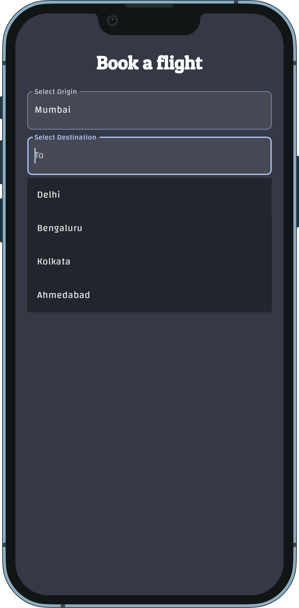
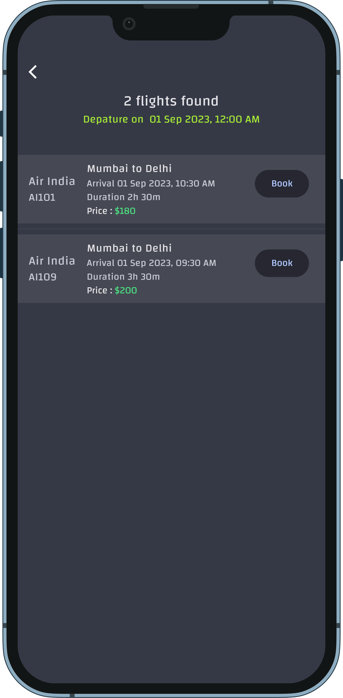

# FlutterFly - Flight Booking App ✈️


FlutterFly is a flight booking app that allows users to search for flights, view flight details, and book flights seamlessly. The app is built using Flutter and Riverpod for state management.

## Features ✨

- 🌍 Search for flights by origin, destination, and date.
- 🛫 View a list of available flights matching the search criteria.
- ✈️ See detailed information about a selected flight.
- 📝 Book a flight and complete the booking process.

## Screenshots 📸

<p float="left" style="display: flex; justify-content: space-between margin-right: 16px margin-left: 16px;">
     
     
     
  
  
  
</p>
<p float="left" style="display: flex; justify-content: space-between margin-right: 8px margin-left:8px">

     
     
      
      
</p>
<p float="left" style="display: flex; justify-content: space-between margin-right: 8px margin-left:8px">

     
     
      
      
        
</p>

## Download APKs 📲

You can download the APKs for the FlutterFly app from the [Releases](https://github.com/Shreemanarjun/flutter_fly/releases) section of this repository.

- **Fat APK**: Contains all CPU architectures. Suitable for most devices.
- **Split APKs**: Optimized APKs for specific CPU architectures (armeabi-v7a, arm64-v8a, x86, x86_64). Download the appropriate split APK for your device.


## Getting Started 🚀

1. **Clone the repository:**

   ```sh
   git clone https://github.com/Shreemanarjun/flutter_fly.git
   ```

2. **Navigate to the project directory:**

   ```sh
   cd flutter_fly
   ```

3. **Install dependencies:**

   ```sh
   flutter pub get
   ```

4. **Run the app:**

   ```sh
   flutter run
   ```


## Technologies Used 🛠️

- Flutter - UI framework.
- Riverpod - State management.


## Contributing 🤝

Contributions are welcome! If you find any issues or want to add new features, feel free to open a pull request.

## License 📄

This project is licensed under the MIT License - see the [LICENSE](LICENSE) file for details.
